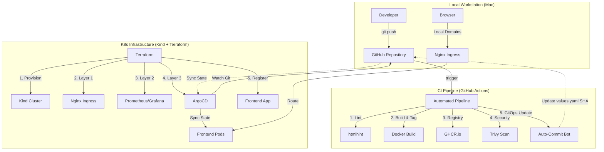

# DevOps Playground: AI News Portal 🚀

Welcome to the **DevOps Playground**, a complete end-to-end journey from frontend development to automated CI/CD and Infrastructure as Code. 

This repository serves as a hands-on tutorial for learning modern DevOps practices, specifically focused on **GitOps**, **Observability**, and **One-Click Infrastructure**.

---

## 🏗️ Project Architecture

Below is the high-level architecture of our automated GitOps ecosystem:



---

## 📖 Step-by-Step Implementation

### Phase 1: Frontend Development
A premium, responsive **AI News Portal** featuring glassmorphism, dynamic themes, and company-specific card styles.

### Phase 2: Containerization (Docker)
Packaged using a security-hardened `Dockerfile` based on `nginx:alpine` with automated security patching.

### Phase 3: CI/CD Pipeline (GitHub Actions)
Automated lifecycle including linting, unique SHA tagging, **Trivy** security scanning, and an automated GitOps bot.

### Phase 4: One-Click Infrastructure (Terraform)
The entire cluster and its services are 100% automated via Terraform:
- **Core**: Kind Kubernetes Cluster (1 Control Plane, 1 Worker).
- **Ingress**: Nginx Controller for local domain routing.
- **Monitoring**: Kube-Prometheus-Stack (Prometheus & Grafana).
- **GitOps Engine**: ArgoCD Engine & Automated Frontend Application.

---

## 🛠️ Getting Started Locally

### 1. Provision Infrastructure
Deploy everything from scratch with a single command:
```bash
cd terraform
terraform init
terraform apply -auto-approve
```

### 2. Configure Local DNS (One-time setup)
Add the local domains to your `/etc/hosts` file:
```bash
echo "127.0.0.1 frontend.local grafana.local prometheus.local argocd.local" | sudo tee -a /etc/hosts
```

### 3. Access your Stack (No Port-Forwarding Needed!)
| Service | URL |
| :--- | :--- |
| **AI News Portal** | [http://frontend.local](http://frontend.local) |
| **ArgoCD UI** | [http://argocd.local](http://argocd.local) |
| **Grafana Dashboards** | [http://grafana.local](http://grafana.local) |
| **Prometheus Browser** | [http://prometheus.local](http://prometheus.local) |

> **Note**: For ArgoCD, retrieve your admin password using:
> `kubectl -n argocd get secret argocd-initial-admin-secret -o jsonpath="{.data.password}" | base64 -d; echo`

---

## 🎓 Key Learnings
- **Infrastructure as Code (IaC)**: Eliminating manual `helm` or `kubectl` commands.
- **GitOps Loop**: Git is the single source of truth for both apps and infra.
- **Observability**: Real-time metrics collection using the industry-standard Prometheus stack.
- **Ingress Routing**: Professional URL-based access to local Kubernetes services.

---
**Maintained by**: Ramesh Surapathi
